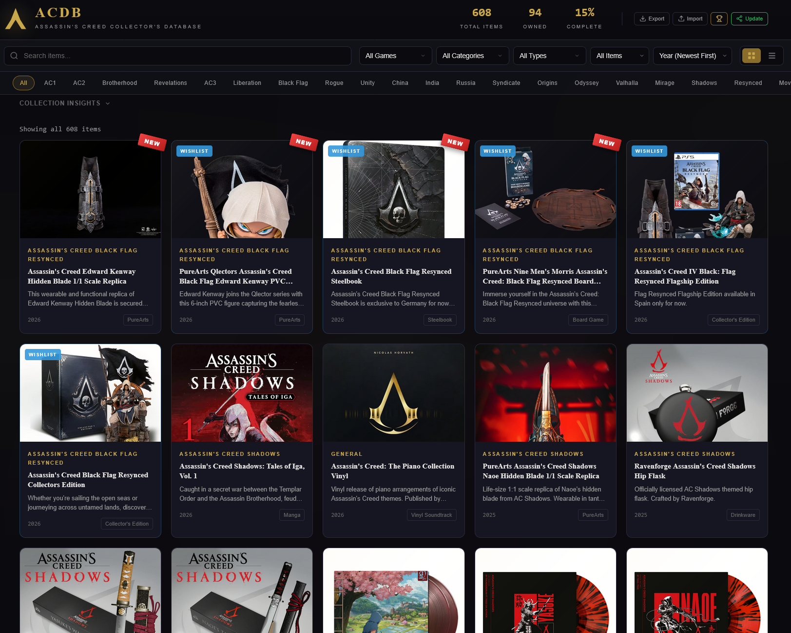
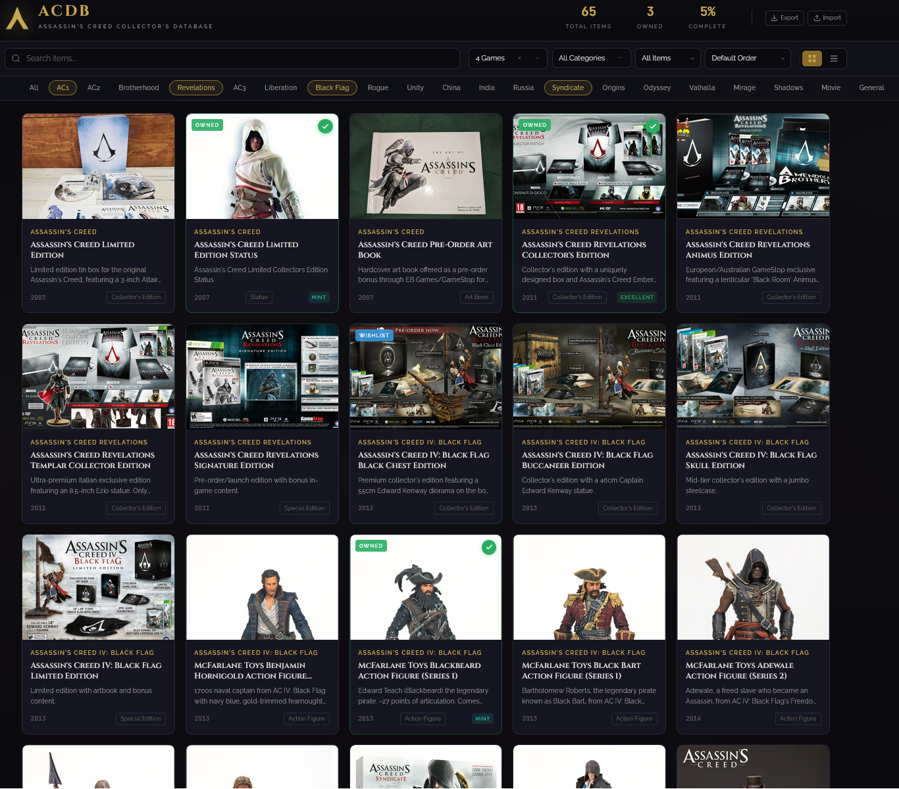
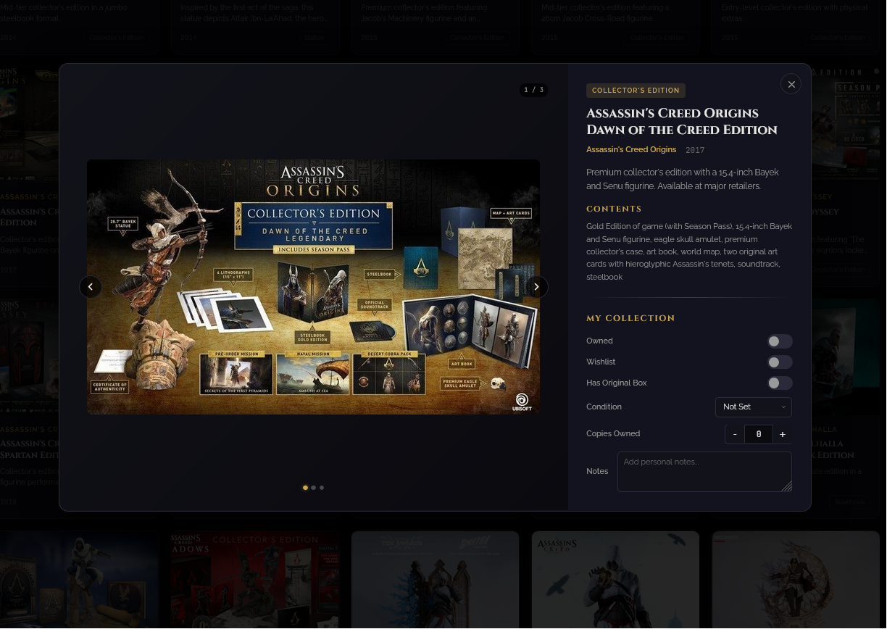

# ACDb - Assassin's Creed Collector's Database

A fan-made collection tracker for official Assassin's Creed collectibles. Browse, search, and track your collection — all in your browser. Share your progress and compete on the leaderboard.

**Live site:** [acdb.theprivategeek.com](https://acdb.theprivategeek.com)

<p>
  
</p>
<p>
  
</p>
<p>
  
</p>

## Features

- **600+ officially licensed items** — statues, figurines, action figures, collector's editions, art books, novels, comic books, steelbooks, replicas, and more
- **Collection tracking** — mark items as owned, wishlist, track condition, number of copies, original box status, purchase price, acquisition date, and personal notes
- **Smart field logic** — setting condition or copies automatically marks as owned; clearing ownership resets all fields
- **Collection sharing** — share your collection publicly with a unique profile URL and display name
- **Collector's Leaderboard** — see how your collection stacks up against other collectors, ranked by items owned
- **Cascading filters** — multi-select by game, category, and type. Filters cascade: selecting a game narrows categories, selecting a category narrows types. Filters persist across page reloads
- **Collection Insights** — collapsible stats dashboard showing completion progress by game and category (sorted by completion %), condition breakdown, and 100% completion celebration with confetti
- **Multi-image gallery** — swipe or click through multiple photos per item with smooth directional slide transitions and full-screen lightbox zoom
- **Shareable item links** — each item has a unique URL. Ctrl+click or right-click to open in a new tab. Browser back button closes the modal
- **Game timeline** — quick-access bar spanning every AC title from AC1 to Shadows
- **Search** — instant search across item names, games, descriptions, and contents with result count
- **Export / Import** — download your collection as JSON, import it on another device
- **Fully static** — no backend needed for core features. All collection data stays in your browser (LocalStorage)
- **Responsive** — works on desktop, tablet, and mobile with touch swipe support

## How It Works

### Collection Tracking

Your collection data is stored entirely in your browser's LocalStorage. Nothing is sent to any server. You can back up your data anytime using the Export button in the header, and restore it with Import. Filters are remembered between visits.

Just open the site, browse the database, and click any item to track it in your collection.

### Sharing & Leaderboard

You can optionally share your collection with the community:

1. Click **Share** in the header and choose a display name
2. Your owned items are uploaded to a lightweight API (Cloudflare Workers + KV)
3. You get a public profile URL you can share with friends or on social media
4. Your profile appears on the **Collector's Leaderboard**, ranked by items owned
5. Click **Update** anytime to sync your latest collection
6. You can delete your shared profile at any time from the share menu

Sharing is entirely optional. Your local collection works independently — sharing just creates a public snapshot of your owned items.

## Tech Stack

- HTML / CSS / JavaScript (vanilla, no frameworks)
- LocalStorage for collection persistence
- Cloudflare Workers + KV for sharing API
- Hosted on GitHub Pages with custom domain
- Cloudflare Web Analytics (no cookies)

## Project Structure

```
js/
  database.js    — item database (390+ entries)
  images.js      — image path mappings
  utils.js       — shared utilities (toast, escapeHTML, slugify, etc.)
  modal.js       — item modal, gallery, lightbox
  stats.js       — stats dashboard, completion celebration
  collection.js  — export/import
  sharing.js     — sharing, profile view, leaderboard
  devtool.js     — admin code generator
  app.js         — filters, rendering, routing, events, init
css/
  style.css      — all styles
worker/
  acdb-worker.js — Cloudflare Worker API
```

## Disclaimer

This is a fan-made collection tracker, not affiliated with or endorsed by Ubisoft. Assassin's Creed and all related images and trademarks are property of Ubisoft Entertainment. No personal data is collected. Shared profiles are public and stored on Cloudflare.

## Feedback

Found a bug, missing item, or have a suggestion? [Open an issue](https://github.com/ThePrivateGeek/ACDb/issues).
