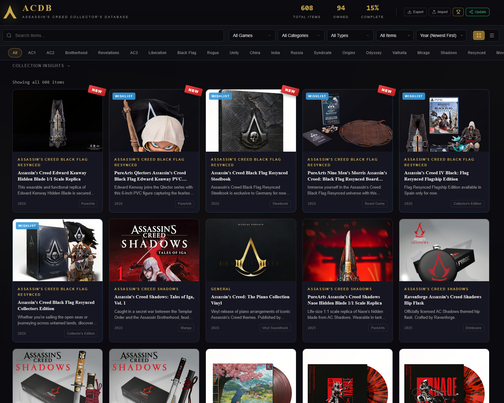
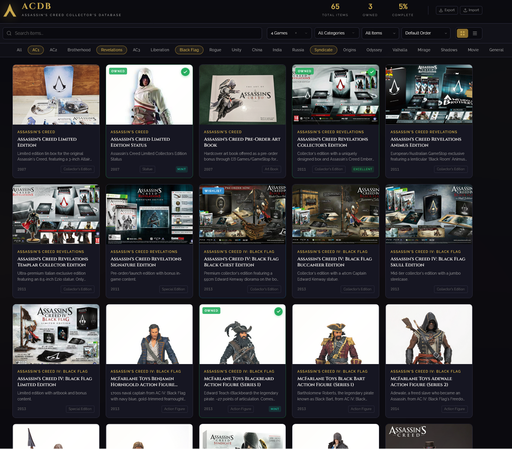
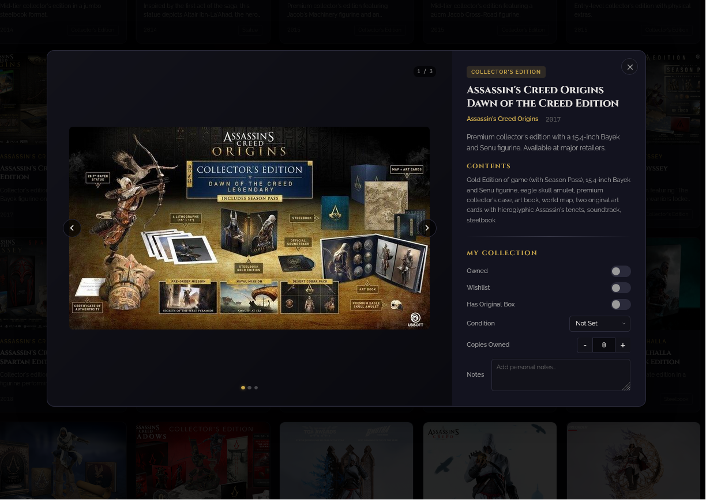

# ACDb - Assassin's Creed Collector's Database

A fan-made collection tracker for official Assassin's Creed collectibles. Browse, search, and track your collection right in your browser, or sign in with Google to see it on any device. Share your progress and compete on the leaderboard.

**Live site:** [acdb.theprivategeek.com](https://acdb.theprivategeek.com)

<p>
  
</p>
<p>
  
</p>
<p>
  
</p>

## Features

- **600+ officially licensed items** — statues, figurines, action figures, collector's editions, art books, novels, comic books, steelbooks, replicas, and more
- **Collection tracking** — mark items as owned, wishlist, track condition, number of copies, original box status, purchase price, acquisition date, and personal notes
- **Smart field logic** — setting condition or copies automatically marks as owned; clearing ownership resets all fields
- **Cloud sync (optional)** — sign in with Google to keep your collection in your account and see it on every device you use. Changes sync within seconds, work offline and catch up later, and signing out clears the browser you used
- **Publish your collection** — get a public profile page (unique URL and display name) and a spot on the leaderboard. When you're signed in, your profile updates automatically
- **Collector's Leaderboard** — see how your collection stacks up against other collectors, ranked by items owned
- **Cascading filters** — multi-select by game, category, type, and series. Filters cascade: selecting a game narrows categories, selecting a category narrows types, selecting a type narrows series. Filters persist across page reloads
- **Series browsing** — comics, graphic novels, manga, novel lines, and the Hachette partwork carry a `series` field (e.g. *Assassin's Creed: Assassins*) that groups single issues with the trade paperbacks that collect them, and can span types (the *Last Descendants* novels and the *Locus* comic share one series). The Series dropdown only appears when the current selection contains series items, and the series line in an item's card is a one-click filter to the whole run
- **Read online** — comics, graphic novels, and manga with a free scan in the [Internet Archive's Assassin's Creed anthology](https://archive.org/details/assassins-creed-graphic-novels-and-comics-anthology) show a "Read on Internet Archive" button in their item card. The entry's optional `read` field holds the book's path inside that collection, unencoded as the archive names it (e.g. `07. AC Templars/AC Templars 2016 (3)`), and `readUrl` in `js/utils.js` builds the link; a full `https://` URL is used as-is for books hosted elsewhere. An optional `readLang` (e.g. `"fr"`) marks a scan in a different language and adds a tag such as "(Fr)" to the button. collected editions only get one when the archive holds a scan of the collection itself, not just its single issues
- **Reading tracker** — novels, comic books, graphic novels, manga, and gamebooks get a Reading section in their item card: mark them as read (with an optional finished date), whether or not you own them. Read items get a badge, the status filter has "Read" / "Not Read" options, and Collection Insights shows your progress per series. Collected editions carry a `collects` list of the items they reprint, so marking a trade paperback read also marks its issues read (never the other way round, and unmarking it changes nothing) Which types count is `READABLE_TYPES` in `js/utils.js`
- **Reading order** — a "Reading Order" view (the Reading Order tab in the header, `#reading`) lists curated orders with a Chronological / Release toggle, read switches and an "Up next" shortcut. **Complete Lore** covers every canon novel, comic and manga in story order (120 entries, grouped under era headings); a game filter narrows it to the stories tied to one game (`#reading/complete/valhalla`) or to the original stories not tied to any game. There are also the **Oliver Bowden Novels** and **Non-canon Stories**. Books in an order show their position and the next book in their item card. Orders live in `js/reading-orders.js`: each entry is an item id, the start year and in-universe setting of its main story, and its earliest release date; the list order is the chronological order. Placement rules: a unit sits where its main historical story happens, story arcs stay together in issue order, anthologies split by era, and collected editions that only reprint issues are left out
- **Collection Insights** — collapsible stats dashboard showing completion progress by game and category (sorted by completion %), condition breakdown, reading progress by series, and 100% completion celebration with confetti
- **Multi-image gallery** — swipe or click through multiple photos per item with smooth directional slide transitions and full-screen lightbox zoom
- **Shareable item links** — each item has a unique URL. Ctrl+click or right-click to open in a new tab. Browser back button closes the modal. The share button in the item modal opens the native share sheet on mobile (copies the link on desktop); shared links unfurl with the item's own image and description in Slack/Discord/social media
- **Game timeline** — quick-access bar spanning every AC title from AC1 to Shadows
- **Search** — instant search across item names, games, series, descriptions, and contents with result count
- **Back up / Restore** — save your collection as a JSON file from the account menu and restore it on another device
- **Static site** — the database and collection tracking run entirely in the browser (LocalStorage); a small Cloudflare Worker handles sign-in, sync and sharing
- **Responsive** — works on desktop, tablet, and mobile with touch swipe support

## How It Works

### Collection Tracking

Your collection is stored in your browser's LocalStorage. Unless you sign in or share, nothing is sent to any server. You can back up your data anytime with **Back up to file** in the account menu (top right), and restore it with **Restore from file**. Filters are remembered between visits.

Every entry in `js/database.js` carries a permanent numeric `id`, and collections, exports, and shared profiles are keyed by it, so item names can be corrected without affecting anyone's data. New entries take the next unused number (the dev tool fills it in); an id is never changed or reused, even if its item is removed. Collections saved before ids existed are migrated once on load; entries whose name no longer matches an item are dropped. The old name-keyed copy stays in LocalStorage as a backup until January 2027, when it is deleted automatically.

Just open the site, browse the database, and click any item to track it in your collection.

### Accounts & Sync

Signing in is optional. **Sign in** in the header (or the banner that appears once you own something) takes you to Google, which asks you to pick an account and sends you back. From then on:

- Every change is saved in your browser first, then sent to your account within a few seconds. Other devices pick it up when they open the site, when you switch back to the tab, or when the connection returns.
- When the same item was changed in two places, the most recent change wins.
- The first time you sign in on a browser that already has items, they're combined with your account. If the same item differs, you choose which version to keep (the most recent change, this browser's, or the account's).
- **Sign out** clears the collection from that browser (it stays in your account). **Download all account data** and **Delete account** are in the account menu.

How it works: sign-in uses Google's OAuth 2.0 authorization code flow with PKCE as a plain redirect, so no Google script loads until you click Sign in. The Worker exchanges the code with Google, asks only for your email address and account ID, and gives the browser its own session token. See `privacy.html` for what is stored.

### Sharing & Leaderboard

You can optionally publish your collection for the community:

1. Click **Publish collection** in the header (or **Join the Leaderboard** on the leaderboard) and choose a display name
2. Your owned items are uploaded to a lightweight API (Cloudflare Workers + D1)
3. You get a public profile URL you can share with friends or on social media
4. Your profile appears on the **Collector's Leaderboard**, ranked by items owned
5. Open **My public profile** in the account menu and click **Update Profile** anytime to sync your latest collection. When you're signed in, the profile belongs to your account and updates automatically; signing in links a profile you shared earlier from that browser
6. You can delete your public profile at any time from the same window

Sharing is entirely optional. Your local collection works independently — sharing just creates a public snapshot of your owned items.

## Tech Stack

- HTML / CSS / JavaScript (vanilla, no frameworks)
- LocalStorage for collection persistence
- Cloudflare Workers + D1 for accounts, sync, sharing and the leaderboard (deployed by hand; see `worker/README.md`)
- Google sign-in (OAuth 2.0 with PKCE)
- Hosted on GitHub Pages with custom domain
- Cloudflare Web Analytics (no cookies)

## Project Structure

```
js/
  database.js    — item database (630+ entries, each with a permanent numeric id)
  images.js      — image path mappings
  reading-orders.js — curated reading orders (chronological list + release dates)
  utils.js       — shared utilities (toast, escapeHTML, slugify, etc.)
  modal.js       — item modal, gallery, lightbox
  stats.js       — stats dashboard, completion celebration
  collection.js  — export/import
  sync.js        — cloud sync: merge rules, push/pull
  auth.js        — Google sign-in, account menu, sign-in banner
  sharing.js     — sharing, profile view, leaderboard
  reading.js     — reading order view and the item modal's reading order line
  devtool.js     — admin code generator
  app.js         — filters, rendering, routing, events, init
css/
  style.css      — all styles
s/
  <slug>.html    — static share pages with per-item Open Graph tags
                   (generated by tools/build-share-pages.py; re-run after adding items)
privacy.html     — privacy policy
worker/
  acdb-worker.js — Cloudflare Worker API
  migrations/    — D1 schema (applied in the D1 console)
  README.md      — deploy runbook
tools/
  validate-catalog.py — checks database.js, images.js and reading-orders.js (ids,
                   names, fields, games, categories, images, read links, share
                   pages, reading order entries)
  test-sync-merge.mjs — tests for the sync merge rules (node tools/test-sync-merge.mjs)
.githooks/
  pre-commit     — runs validate-catalog.py before every commit
```

### Catalog validation

A pre-commit hook runs `tools/validate-catalog.py` and blocks the commit if the catalog has errors, such as a missing or duplicate id, a duplicate name, an unknown game or category, or an image file that doesn't exist. Warnings, like a missing share page, are printed but don't block. Enable the hook once per clone:

```
git config core.hooksPath .githooks
```

Run the check by hand with `python3 tools/validate-catalog.py`, and skip the hook in an emergency with `git commit --no-verify`.

## Disclaimer

This is a fan-made collection tracker, not affiliated with or endorsed by Ubisoft. Assassin's Creed and all related names, logos, and trademarks are property of Ubisoft Entertainment. Product images are the property of their respective manufacturers and retailers (e.g. PureArts, Ravenforge). They are used for identification and reference only; no copyright or affiliation is claimed. Contact info@theprivategeek.com to request removal of any image. No personal data is collected unless you sign in; see the [privacy policy](https://acdb.theprivategeek.com/privacy.html). Shared profiles are public and stored on Cloudflare.

## Feedback

Found a bug, missing item, or have a suggestion? [Open an issue](https://github.com/ThePrivateGeek/ACDb/issues).
